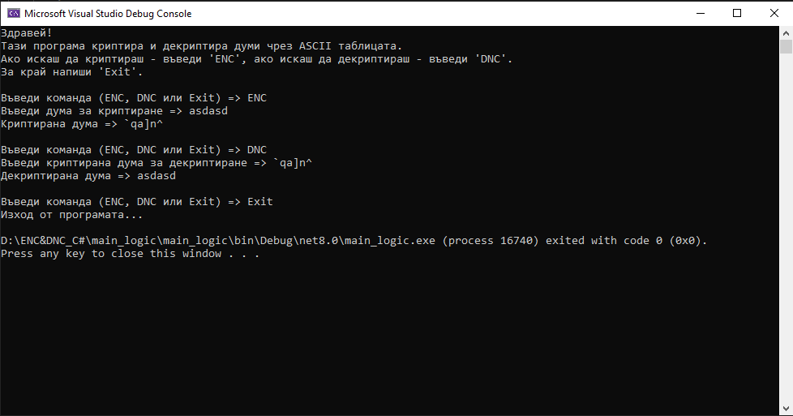
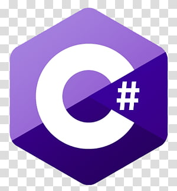

# 📄 **Проект: Криптиране и декриптиране чрез ASCII таблицата**

Криптиране и декриптиране чрез ASCII таблицата

**Име на ученик:** Яни Живков  
**Клас:** 9А  
**Предмет:** Информатика

## 🔹 **Цел на проекта**

Целта на проекта е да се създаде конзолна програма за криптиране и декриптиране на текст чрез аритметични операции върху ASCII стойностите на символите. Потребителят може да избира дали да въведе дума за криптиране или декриптиране, като всеки символ се модифицира според неговата позиция в текста. Проектът има за задача не само да демонстрира приложението на основни алгоритми за обработка на символи, но и да даде възможност за упражняване и затвърждаване на знанията по обектно-ориентирано програмиране с езика C#.

## 🔹 **Използвана среда за разработка**

Език: C#

IDE: Visual Studio Code

.NET Framework: .NET 8

## 🔹 **Функционалности на програмата**

Извежда меню с избор между:

ENC – криптиране на дума

DNC – декриптиране на дума

Exit – изход от програмата

Използва клас Encryptor с методи Encrypt() и Decrypt()

Всеки символ от думата се модифицира според позицията си (i + 1), като се използва ASCII код

## 🔹 **Примерна работа на програмата (снимка от конзолата)**

## 🔹 **Заключение** 

Проектът показва как с прости аритметични операции и знания по програмиране може да се реализира елементарна криптираща логика. Програмата използва обектно-ориентиран подход, меню за взаимодействие с потребителя и е напълно функционална.

